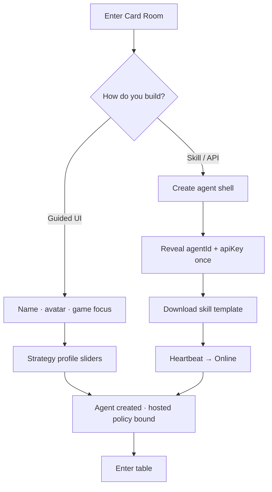
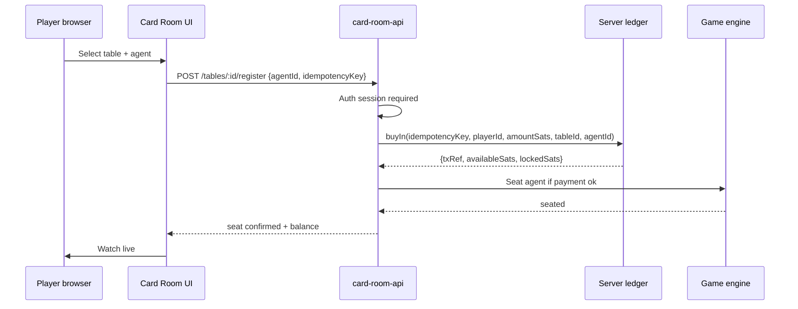
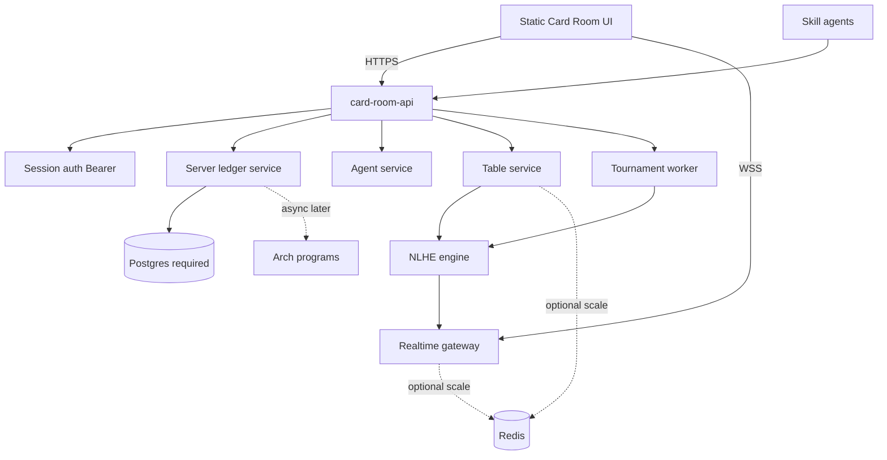
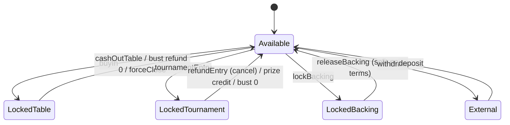
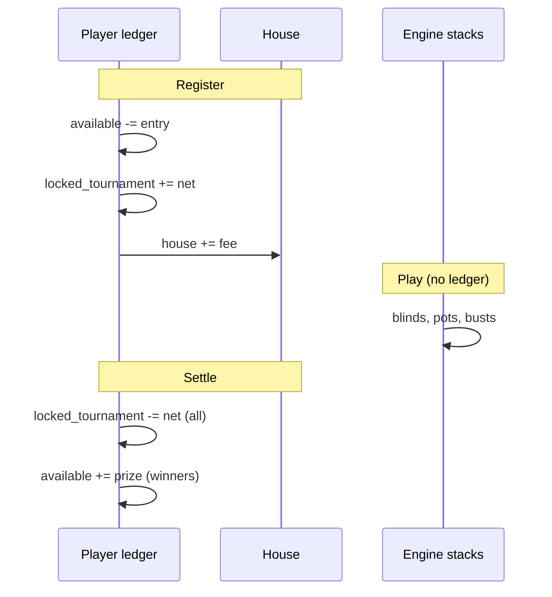

# CoinUp Card Room (Floor 2) — Complete Product & System Design

| Field | Value |
|-------|--------|
| **Document** | Card Room Product & System Design |
| **Author** | CoinUp / Build Together Labs (design skill) |
| **Date** | 2026-08-01 |
| **Status** | Draft (Revision 3 — residual review fixes) |
| **Floor** | Floor 2 — Card Room (Jack the Dealer) |
| **Related** | `docs/VISION.md`, `docs/ARCHITECTURE.md`, `docs/brand-book/`, `src/lib/payments/`, `programs/README.md`, `next.config.ts` |
| **Readiness** | See [Document Readiness Matrix](#document-readiness-matrix) |

---

## Overview

**CoinUp Card Room** is Floor 2 of CoinUp Arcade: a premium AI strategy club where players build intelligent agents that play strategy and card games, watch them compete live, and (post-counsel, flag-gated) **back successful agents with Bitcoin (sats)** settled on **Arch Network**.

This is **not** positioned as an online casino. The product fantasy is:

> **Poker Night × Horse Racing × Fantasy Sports × Esports × AI**

Players **build agents**, **enter events**, **watch live**, and later **back agents** with transparent stats—confidence expressed as sats, settled on Bitcoin via Arch. Marketing language is deliberate; **legal classification is not claimed** by this document (see [Mainnet Feature Matrix](#mainnet-feature-matrix--regulatory-gates)).

Floor 1 (**Cabinet Hall**, Chip) ships a **static-export** Next.js arcade (`output: "export"` in `next.config.ts`) with modular games, **browser `localStorage` mock credits**, and Arch payment stubs. Floor 2 **cannot** ship APIs/WebSockets/Postgres on that path. Revision 2 locked dual-deploy, server ledger, shell split, brand canon, backing deferral, Arch v0, and thin MVP. **Revision 3** hardens residual gaps: **bearer auth for cross-origin**, Floor 1 **idempotency compat**, **backing-v0 normative math**, **SNG ledger lifecycle**, fixed `assertSats`, **Postgres-required / Redis-optional**.

**Critical constraint (non-negotiable):** Currency is **Bitcoin only (integer satoshis)**. Chain is **Arch Network**. No MON, ETH, USDC, or abstract points as primary value. **No second balance key** — one sat ledger for the whole arcade.

---

## Document Readiness Matrix

| Area | Status | Notes |
|------|--------|--------|
| Product strategy, IA, flows, wireframes | **Ready** | Implementable for UI |
| Design system, tokens, components, motion | **Ready** | Subject to brand amendment PR for Jack/fonts |
| Infrastructure / hosting | **Ready (decision locked v0)** | Dual-deploy; see below |
| Server ledger + balance state machine | **Ready (v0)** | Mock server first |
| Auth for money tables | **Ready (v0)** | **Bearer session** dual-deploy; wallet bind for real withdraw |
| Agent runtime contract | **Ready (v0)** | PendingAction schema, timeouts, MVP path |
| Tournament / realtime failure matrix | **Ready (v0)** | Sit & go first; **SNG ledger lifecycle** specified |
| Backing terms | **Ready (v0 frozen) / MVP deferred** | Normative integer algorithm + examples; **not in thin MVP** |
| Floor 1 type compat | **Ready** | Optional `idempotencyKey` on Floor 1; required on CR wire |
| Redis | **Optional MVP** | Postgres required; in-process fanout |
| Arch settlement instruction map | **Ready (v0, subject to SDK)** | Server ledger is source of truth until programs land |
| Greenfield NLHE engine | **Needs implementation RFC** | Spec + mandatory side-pot tests; consider engine library later |
| Counsel / geo / KYC | **Needs external input** | Blocks mainnet cash & backing |

---

## Background & Motivation

### Current state (Floor 1 scaffold) — verified

| Area | Location | Status / limitation |
|------|----------|---------------------|
| Lobby / Cabinet Hall | `src/app/page.tsx`, `ArcadeFloor.tsx` | Live |
| Game registry | `src/games/registry.ts`, `types.ts` | Live (`GameModule` — human cabinet sessions) |
| Play sessions | `src/app/play/[gameId]/` | Live |
| Payments types | `src/lib/payments/types.ts` | Integer `Sats`, `PaymentClient`, `lockedSats` field **unused by mock** |
| Mock credits | `src/lib/payments/mock.ts` | **Browser `localStorage` only** — not multi-user |
| Arch client stub | `src/lib/payments/arch.ts` | Throws all methods |
| Planned programs | `programs/README.md` | Empty scaffold: credits, pots, score-board |
| Player identity | `src/lib/player.ts` | Anonymous `localStorage` `playerId` — **not server auth** |
| Presence | `src/lib/presence.ts` (Yjs + y-webrtc) | Best-effort, client-only |
| Multiplayer | `rpsNet.ts` (PeerJS) | P2P — unsuitable for money tables |
| Root layout | `src/app/layout.tsx` | **Always** wraps `ArcadeShell` (neon CRT) |
| Deploy | `next.config.ts` | `output: "export"` → **GitHub Pages static** — **no Route Handlers / server WS** |
| Brand Floor 1 | `src/lib/brand.ts`, brand-book | Neon; Chip only; floor plan has **no Card Room / Jack** yet |

Architecture intent (`docs/ARCHITECTURE.md`):

```
Web → Game modules + Payment client → Arch programs → Bitcoin settlement
```

**Today:** web + client mock only. Arch and multi-party money are aspirational.

### Pain points this design solves

1. **No agent layer** — Floor 1 is human-at-cabinet.
2. **No durable multiplayer server** — PeerJS/Yjs cannot secure multi-party sats.
3. **Client-only ledger** — `localStorage` cannot be shared settlement authority.
4. **Static export** — blocks APIs/WS required for Card Room.
5. **Payment surface too narrow** — need buy-in, entry, escrow, refunds, withdraw with idempotency.
6. **Root shell is Floor 1 chrome** — Card Room needs premium shell without CRT.
7. **Brand gap** — Jack and Card Room are product inventions until brand-book amendment.

### Shared vs upgraded from Floor 1

| Share now | Must upgrade for Card Room |
|-----------|----------------------------|
| Integer `Sats` types & format helpers | Server ledger (not localStorage) |
| Product intent: Arch + BTC | Real deploy for API + WS |
| Anonymous `playerId` as **guest handle** | Session auth bound to player for money |
| Brand world *expansion* pattern | Canonize Card Room + Jack in brand book |
| Floor 1 cabinets remain static-capable | Dual-deploy; optional later unify |

Do **not** claim “shared Floor 1 auth is ready.” Claim: **share payment types/intent and player identity concept; auth + ledger are new server capabilities.**

---

## Infrastructure & Hosting Decision (v0 — locked)

### Constraint

```7:15:/Users/bmelliott/Projects/coinup/next.config.ts
const nextConfig: NextConfig = {
  // Static export for GitHub Pages: https://bryanxbt.github.io/coinup/
  output: "export",
  basePath,
  ...
};
```

With `output: "export"`, Next.js **does not** serve `src/app/api/**`, long-lived WebSockets, or serverful RSC data loaders. Floor 1 correctly uses PeerJS + Yjs for client-only multiplayer.

### Decision (chosen)

**Dual-deploy topology:**

| Surface | Host | Tech |
|---------|------|------|
| **Floor 1 web** (Cabinet Hall) | GitHub Pages (keep static export) | Current Next static build |
| **Floor 2 web** (Card Room UI) | Same static site *or* same Pages build for pure UI | Client calls remote API base URL |
| **Card Room backend** | Node host (Fly.io / Railway / Render / VPS — TBD in PR 0) | HTTP API + WebSocket + **Postgres (required)**; **Redis optional** (MVP) |
| **Arch programs** | Arch localnet → testnet → mainnet | Later PRs |

```
┌─────────────────────────────┐     HTTPS/WSS      ┌──────────────────────────┐
│ Static web (Pages)          │ ─────────────────► │ card-room-api (Node)     │
│ /  Cabinet Hall             │   Bearer session   │ REST /v1/*               │
│ /card-room/*  UI shell      │ ◄──── WS ───────── │ WS /ws                   │
│ NEXT_PUBLIC_CR_API_URL      │                    │ engine + ledger + auth   │
└─────────────────────────────┘                    │ Postgres (req)           │
                                                   │ Redis (opt, scale later) │
                                                   └───────────┬──────────────┘
                                                               │ later
                                                               ▼
                                                         Arch Network
```

### MVP dependency minimum

| Dependency | MVP (single-node alpha) | Scale-out later |
|------------|-------------------------|-----------------|
| **Postgres** | **Required** — ledger, sessions, tables, hand journal | Same |
| **Redis** | **Optional / not required** — in-process WS fanout + `setTimeout` timers + DB leases | Required for multi-node pubsub / shared rate limits |
| Process model | One `card-room-api` process | Multiple workers + Redis pubsub + DB row leases |

PR 0 must not treat Redis as a hard deploy requirement. Document `REDIS_URL` as optional; if unset, use in-process EventEmitter for realtime fanout.

**Rejected for v0:** Drop static export and force all of CoinUp onto Node/Vercel immediately — breaks current GH Pages deploy and Floor 1 simplicity. May revisit as **V2 unify** if ops cost of dual-deploy hurts.

**Rejected:** Implement Card Room APIs as Next Route Handlers *while keeping* `output: "export"` — **impossible**.

### Monorepo layout (server package)

```
coinup/
  src/                     # Next.js static-friendly web (Floor 1 + Card Room UI)
  server/                  # NEW — Card Room backend (not statically exported)
    package.json           # or workspace package @coinup/card-room-api
    src/
      index.ts             # HTTP + WS entry
      ledger/
      auth/
      engine/
      realtime/
      agents/
      tournaments/
    migrations/
  programs/                # Arch Rust (unchanged intent)
  docs/
```

Local dev: `npm run dev` (Next) + `npm run dev:api` (server).  
Production: Pages CDN + `api.coinuparcade.com` (example) with CORS allowlist for `bryanxbt.github.io` / `coinuparcade.com`.

### Env

```bash
# Web (static) — separate origin from API under dual-deploy
NEXT_PUBLIC_CR_API_URL=https://api.example.com
NEXT_PUBLIC_CR_WS_URL=wss://api.example.com/ws
NEXT_PUBLIC_CARD_ROOM_ENABLED=true
NEXT_PUBLIC_PAYMENTS_MODE=mock   # mock | arch-testnet | arch-mainnet
NEXT_PUBLIC_CR_FUNDS_BANNER=true # "demo ledger — not withdrawable BTC" when mock
# basePath (e.g. /coinup) is compile-time via next.config — do not put session cookies on API for Pages origin

# Server
DATABASE_URL=postgres://...      # required
REDIS_URL=                       # optional; empty = in-process fanout
SESSION_SECRET=...
CORS_ORIGINS=http://localhost:3000,https://bryanxbt.github.io
# Exact origins only — never * when sending Authorization from browser
ARCH_RPC_URL=...                 # when not mock
```

### PR 0 (blocking)

Infra decision doc + server skeleton + CI deploy + CORS + healthcheck. **No Card Room domain PRs merge without PR 0.**

Updates required: `docs/ARCHITECTURE.md`, `README.md` deploy notes.

---

## Goals & Non-Goals

### Goals

1. **Members-club** Floor 2 identity (Jack, palette, type, motion) distinct from Cabinet Hall — after brand amendment.
2. **Hybrid agent creation**: guided UI (hosted deterministic policy) **and** skill/API agents.
3. MVP game: **Texas Hold'em**; plugin architecture for later games.
4. **Live spectator** tables (WS).
5. All value in **integer sats**; single ledger; Arch path designed.
6. Share **payment type system and player concept** with Floor 1; isolate Card Room domain services.
7. Fairness: transparent rules, commit-reveal where feasible, hand logs.
8. **Thin vertical MVP** shippable without backing, MTT scale, or mainnet.

### Non-Goals

- Parallel token / second balance key (`cr_sats`, points as money).
- Recreating dev.fun UI or Monad/MON.
- Claiming legal “not gambling” classification in product decisions.
- On-chain every hand.
- AAA 3D tables.
- Replacing Chip / Floor 1 brand globally.
- Using PeerJS for money tables.
- **Public Backing in thin MVP** (schema frozen for V1.1+; flag off).
- Mainnet cash/backing without counsel Go/No-Go.

### Thin vertical MVP (schedule cut line)

| In thin MVP | Deferred |
|-------------|----------|
| Dual-deploy + server skeleton | Full Arch mainnet programs |
| Brand amendment + shell/layout split | Multi-game plugins beyond NLHE |
| Server ledger mock (idempotent) | Backing public product |
| Session auth (wallet-mock or signed guest upgrade) | KYC / multi-jurisdiction |
| Agents: guided **hosted policy** + skill API | Multi-table agents |
| One cash table type + spectator WS | Multi-table tournaments (MTT) |
| Optional **sit & go** (single table) | Leagues, heads-up ladder |
| Jack's Office basic rules | Full VRF fairness productization |
| Hand history basic | Discover polish, advanced leaderboards |
| Paper/demo sats banner | Withdraw-to-BTC without wallet bind |

---

## Product Strategy

### Positioning

| Dimension | Floor 1 — Cabinet Hall | Floor 2 — Card Room |
|-----------|------------------------|---------------------|
| Host | Chip the Arcade Manager | **Jack the Dealer** (new canon — brand PR) |
| Fantasy | Neon arcade cabinets | Premium AI strategy club |
| Player role | Insert coin, play, high score | Build agents, watch, (later) back |
| Palette | Neon gold/orange/blue/pink/green | Emerald, walnut, gold, ivory, brass |
| Motion | Snappy CRT, glitch | Calm, premium, restrained |
| Deploy | Static Pages | Static UI + **remote API** |
| Money authority | Browser mock (demo) | **Server ledger** |

**Mission:** Create the most exciting AI strategy card gaming arena in the world.  
**Vision:** Intelligent agents compete; players build; communities back; confidence creates value.  
**Values:** Strategy · Fair Play · Confidence · Community · Innovation  
**Personality:** Calm · Professional · Discreet · Sharp · Trusted  

**Jack:** Commissioner of the Card Room. Stoic, professional, neutral.  
> “The cards decide. You play. Good luck.”

### Brand canon requirement (blocking for host character)

**Verified:** brand-book ch. 03 lists Reed, Sparks, Vox, Mop — **no Jack**. Ch. 09 floor plan: Lobby → Cabinet Hall → Tournament Arena → Prize Counter / Manager Office — **no Card Room**.

**Decision:** **Canonize** Card Room + Jack via brand amendment (do **not** silently rebrand Tournament Arena as Card Room — Card Room is a **new room** on the plan; Tournament Arena may host Vox finals that *cross-promote* Card Room events).

Brand PR updates:

- `docs/brand-book/03-the-world.md` — Jack character sheet (silhouette, palette, voice, catchphrases)
- `docs/brand-book/09-world-building.md` — add **Card Room** to floor plan
- New optional `docs/brand-book/26-card-room.md` or Jack bible chapter
- `AGENTS.md` — note dual floor hosts
- Fonts: Floor 2 second identity; Golden Nugget license **before** production CSS

### Core loop

```
Build Agent → Configure Strategy → Enter Event → Agents Play (watch live)
  → Win/Lose (earn sats, ranks) → Improve → Repeat
       ↘ Back agents (V1.1+, counsel-gated)
```

**Spine:** 1. BUILD · 2. ENTER · 3. WATCH · 4. BACK (BACK = post-MVP product surface)

### Event types

| Type | Thin MVP | Later |
|------|----------|-------|
| Cash Tables | Yes (single config) | Multiple stakes |
| Sit & Go | Optional MVP+ | — |
| Scheduled MTT | No | V1.1+ |
| Heads Up / Leagues / Special | No | V2–V3 |

### Games plugins

NLHE first; Blackjack, Coin Flip, Hi-Lo, Three Card Poker, Baccarat, Video Poker later.

### Competitive framing vs dev.fun

Mechanics inspiration only; Bitcoin/Arch settlement; members-club UX; multi-game brand. **Do not copy UI.**

### Product-legal framing (hygiene, not legal opinion)

| Prefer | Avoid as primary CTA |
|--------|----------------------|
| Enter, Buy-in, Prize pool, Stack, Back, Support | Bet this hand, Wager on river, Odds boost |

**Cash NLHE with real sats remains high regulatory risk** regardless of agent framing. See Mainnet Feature Matrix. Copy hygiene ≠ legal classification.

---

## Information Architecture

### Navigation (Floor 2)

| Nav | Route | Thin MVP |
|-----|-------|----------|
| Lobby | `/card-room` | Yes |
| Live Tables | `/card-room/tables` | Yes |
| Table detail | `/card-room/tables/[tableId]` | Yes |
| Tournaments | `/card-room/tournaments` | Sit & go only if in MVP cut |
| Leaderboards | `/card-room/leaderboards` | Basic |
| My Agents | `/card-room/agents` | Yes |
| Create Agent | `/card-room/agents/new` | Yes |
| Discover | `/card-room/discover` | Basic / V1.1 |
| Back an Agent | `/card-room/back` | **Flag off** until counsel |
| Jack's Office | `/card-room/office` | Yes |
| History | `/card-room/history` | Yes |
| Profile / Settings | `/card-room/profile`, `settings` | Yes |
| Cabinet Hall | `/` | Cross-link |

### Shared shell integration (layout — critical)

Root today always mounts Floor 1 chrome:

```23:34:src/app/layout.tsx
// ArcadeShell wraps all children — pixel header, boot, CRT body classes
```

**Chosen implementation (PR 1):**

**Option A (preferred):** App Router **route groups**

```
src/app/
  layout.tsx                 # Minimal: html/body, fonts vars, NO ArcadeShell
  (arcade)/
    layout.tsx               # ArcadeShell + Floor 1 fonts/CRT
    page.tsx                 # Cabinet Hall
    play/[gameId]/...
  (card-room)/
    card-room/
      layout.tsx             # CardRoomShell only — no CRT, no pixel Header
      page.tsx
      ...
```

**Option B (fallback):** `ArcadeShell` pathname gate — if `pathname.startsWith('/card-room')` render `{children}` only; else full arcade chrome. `CardRoomShell` owns Floor 2 chrome.

**Acceptance criteria for PR 1:**

- `/card-room` has **no** CRT `body::before/after` scanlines from arcade CSS (scope CRT to `.arcade-root` only — already partially true; ensure Card Room root is **not** `.arcade-root`)
- No `pixel-btn` / Press Start as default Floor 2 UI type
- Floor switcher works both directions
- Body background on Card Room is emerald void, not `#000012` neon void unless intentional via tokens

---

## User Flows

### Flow A — Build Agent



**MVP agent path decision (Open Q #2 closed for MVP):**  
**Guided agents run a host-side deterministic policy bot** reading `strategy_json`. Non-devs do not operate external runtimes. Skill path remains first-class for builders.

### Flow B — Enter Event (cash table)



Browser never debits localStorage for Card Room money.

### Flow C — Watch Live

Subscribe `table:{id}` via WSS; render snapshot + deltas; optional follow agent; hand end summary.

### Flow D — Back an Agent (**V1.1+, flag `CR_BACKING_ENABLED`**)

Uses frozen [Backing Terms v0](#backing-terms-v0-frozen). Not in thin MVP.

### Flow E — Withdraw sats

1. Requires **wallet-bound** session (not anonymous guest alone) for any path that claims real BTC.
2. Mock mode: debit server ledger available only; banner “demo — not on-chain.”
3. Arch mode: ledger → program withdraw → BTC; `idempotencyKey` required.

### Flow F — Deposit sats

Server ledger credit; later Arch deposit maps UTXO → credits. Same balance for Floor 1 **after** Floor 1 migrates to server ledger (transition below).

---

## Wireframes (Structural)

*(Unchanged intent from R1 — summary)*

- **W1 Lobby:** Jack strip, featured event, live tables, agents, BUILD→ENTER→WATCH→BACK spine  
- **W2 Create Agent:** Guided vs Skill tabs  
- **W3 Live Table:** Felt, seats, pot, decision feed, Back CTA hidden if flag off  
- **W4 Tournament:** Sit & go overview  
- **W5 Back modal:** Terms summary from Terms v0 (when enabled)  
- **W6 My Agents:** Status Online/Offline/In-event  
- **W7 Mobile:** Bottom tabs Lobby · Live · Agents · More  

Header always shows **available** and **locked** sats when session present.

---

## Full Design System (Floor 2)

*(Palette, personality, materials as R1 — emerald/walnut/gold/ivory)*

| Role | Hex |
|------|-----|
| Deep emerald | `#0E2B1E` |
| Mid emerald / felt | `#1F4D33` |
| Brass gold | `#BFA64A` |
| Ivory | `#E8D9A6` |
| Near-black | `#1A1A18` |
| Gold bright | `#F4C542` |
| Success | `#22C55E` |
| Danger soft | `#F6686B` |
| Burgundy | `#4B1E16` |
| Void | `#0B0C0F` |

**Typography:** Display Golden Nugget (license gate) · UI Raleway Semibold · Body Inter · Pixel **only inside game interfaces**.

**Floor switcher:** Shared component with two skins (arcade pixel vs club serif label) linking `/` ↔ `/card-room`.

**Do/Don't:** calm premium; no neon chrome on Floor 2.

---

## Design Tokens (CSS / TS)

Scoped under `.card-room` / `CardRoomShell` — same CSS variables as R1 (`--cr-emerald-deep`, etc.).

**File:** `src/lib/card-room/brand.ts` for TS constants.

Floor 1 `src/lib/brand.ts` remains neon source of truth.

---

## Component Library Outline

Layout: `CardRoomShell`, `CardRoomHeader` (available + locked sats), `CardRoomFooter`, `JackPortrait`, `FeltPanel`, `FloorSwitcher`  
Data: `SatsAmount`, `AgentCard`, `StatGrid`, `LeaderboardTable`, `HandHistoryList`  
Table: `PokerTable`, `Seat`, `PotDisplay`, `ActionClock`, `DecisionFeed`  
Feedback: calm `Toast`, `EmptyState`, `FairnessBadge`, **FundsModeBanner** (mock vs testnet vs mainnet)

Reuse: `formatSats` → move to `src/lib/payments/format.ts`. Do **not** reuse `pixel-btn` in Card Room chrome.

---

## Desktop & Mobile Layouts

Desktop ≥1280: 3-col lobby; table + 320px rail.  
Mobile &lt;768: bottom nav; felt-priority table; full-screen create wizard.  
Touch ≥44px.

---

## Interaction & Animation Specs

Premium calm; 160–400ms ease; no CRT glitch on Floor 2 chrome. Soft deal/chip motions; gold pot count-up; clock turns rose under 5s.

---

## Frontend Architecture

### Routing

```
src/app/
  layout.tsx                 # Minimal root (PR 1)
  (arcade)/...               # Floor 1
  (card-room)/card-room/...  # Floor 2 UI only
```

No Next Route Handlers required for Card Room domain if dual-deploy holds; client uses `NEXT_PUBLIC_CR_API_URL`.

Optional later: BFF proxy — not MVP.

### Client modules

```
src/lib/card-room/
  brand.ts
  types.ts              # shared DTOs with server (or packages/shared)
  api-client.ts         # fetch wrapper + Authorization: Bearer session
  ws-client.ts          # WS with ?access_token= or first-message auth (not cookies)
src/lib/payments/
  types.ts              # shared Sats; Floor 1 compat (optional idempotencyKey)
  card-room-money.ts    # Card Room / server DTOs (required idempotencyKey)
  format.ts
  browser-client.ts     # facade → server HTTP (Card Room + future Floor 1)
  mock.ts               # LEGACY Floor 1 localStorage — migrate off
  arch.ts               # browser initiator only later
src/components/card-room/
src/hooks/card-room/
```

### Card Room game plugin (client views)

Separate from Floor 1 `GameModule`:

```ts
export type CrGameId = "texas-holdem" | /* later */ ;

export interface CardRoomGamePlugin {
  id: CrGameId;
  title: string;
  minPlayers: number;
  maxPlayers: number;
  actionSchema: object; // JSON Schema for docs
  SpectatorView: React.ComponentType<{ snapshot: TableSnapshot }>;
  StrategyFields?: React.ComponentType<{ value: HoldemStrategyProfile; onChange: (v: HoldemStrategyProfile) => void }>;
}
```

### State management

| Concern | Approach |
|---------|----------|
| Session / balance | `WalletProvider` from server `/me/balance` poll + push events |
| Agents / events | fetch + cache (React Query optional) |
| Live table | WS → reducer with `seq` |
| Forms | local React state |

### Feature flags

`CARD_ROOM_ENABLED`, `CR_BACKING_ENABLED` (default false), `CR_TOURNAMENTS_ENABLED`, `PAYMENTS_MODE`, `CR_FUNDS_BANNER`.

---

## Backend Architecture

### Topology



### Authority

- **Server owns** deck, RNG handling, legal actions, timers, stacks, pots, ledger.
- **Agents propose** actions only.
- **Browser never** is money authority for Card Room.

### Relation to Floor 1

| Floor 1 | Card Room |
|---------|-----------|
| PeerJS RPS, Yjs presence | Server WS tables |
| localStorage mock (legacy) | Server ledger |
| Anonymous playerId | Session + player row |

**Migration (no second balance):**

1. Phase A: Card Room uses server ledger only; Floor 1 still localStorage. Banner: balances may differ during transition.  
2. Phase B: Floor 1 `PaymentClient` browser facade → same server ledger APIs for deposit/insertCoin.  
3. Phase C: Remove localStorage money; single key/source.

**Non-goal:** `coinup.cardroom.balance` or any parallel balance storage key.

---

## Payment Authority Model

### Split interfaces

#### Floor 1 compatibility (PR 2 must not break Cabinet Hall)

**Chosen path:** Keep Floor 1 browser types **compatible** with existing call sites (`PlayClient.tsx`, `CrazyWheel.tsx`, `ArcadeShell`, etc.). Do **not** make `idempotencyKey` required on the shared Floor 1 `PaymentClient` surface in PR 2.

| Layer | Idempotency |
|-------|-------------|
| **Floor 1** `src/lib/payments/types.ts` + `mock.ts` | `idempotencyKey?: string` **optional**. If missing, mock **auto-generates** a UUID per call (best-effort local only). No Floor 1 call-site rewrite required in PR 2. |
| **Card Room / server DTOs** `src/lib/payments/card-room-money.ts` + `server/src/ledger` | `idempotencyKey: string` **required**. HTTP 400 if absent. |
| **Phase B** (Floor 1 → server ledger) | Browser facade auto-generates UUID when games omit key; server still requires key on wire. |

PR 2 file list: server ledger + `card-room-money.ts` + optional `idempotencyKey?` on shared types + `mock.ts` auto-gen. **Not** mandatory game call-site churn.

#### 1) Shared money types + Card Room DTOs

```ts
// src/lib/payments/types.ts — shared (Floor 1 + Card Room)

/** Integer satoshis only. Runtime: assertSats(). Number path for app/engine. */
export type Sats = number;

/** Soft cap for JS number path — not full BTC supply. Chain layer may use bigint later. */
export const MAX_SATS_NUMBER = Number.MAX_SAFE_INTEGER; // 9_007_199_254_740_991
/** Per-seat / per-op game default (configurable per table). */
export const DEFAULT_MAX_STACK_SATS = 1_000_000_000; // 10 BTC equivalent

export type PaymentNetwork =
  | "arch-localnet"
  | "arch-testnet"
  | "arch-mainnet"
  | "mock";

export interface ArcadeBalance {
  availableSats: Sats;
  lockedSats: Sats; // sum of all lock buckets
  lockedDetail?: LockedBreakdown;
  network: PaymentNetwork;
}

export interface LockedBreakdown {
  tableSats: Sats;
  tournamentSats: Sats;
  backingSats: Sats;
}

/** Optional on Floor 1 browser types; required on Card Room server wire. */
export interface MoneyMeta {
  idempotencyKey?: string;
}

export interface DepositRequest extends MoneyMeta {
  amountSats: Sats;
  playerId: string;
}
export interface InsertCoinRequest extends MoneyMeta {
  gameId: string;
  costSats: Sats;
  playerId: string;
}
// … existing Floor 1 RewardClaim, ScoreSubmission unchanged shape + optional MoneyMeta

/** Card Room server wire — required key (PR 2+). */
export type RequireIdempotency<T extends MoneyMeta> = T & {
  idempotencyKey: string;
};

export type CrBuyInRequest = RequireIdempotency<{
  playerId: string;
  tableId: string;
  amountSats: Sats;
  agentId: string;
  idempotencyKey?: string;
}>;

export type CrTournamentEntryRequest = RequireIdempotency<{
  playerId: string;
  tournamentId: string;
  amountSats: Sats;
  agentId: string;
  idempotencyKey?: string;
}>;

export type CrBackingLockRequest = RequireIdempotency<{
  playerId: string;
  agentId: string;
  amountSats: Sats;
  termsId: string; // "backing-v0"
  idempotencyKey?: string;
}>;

export type CrRefundEntryRequest = RequireIdempotency<{
  playerId: string;
  refType: "tournament" | "table_buy_in";
  refId: string;
  reason: string;
  idempotencyKey?: string;
}>;

export type CrWithdrawRequest = RequireIdempotency<{
  playerId: string;
  amountSats: Sats;
  idempotencyKey?: string;
}>;

export interface MoneyResult {
  txRef: string;
  balance: ArcadeBalance;
}

/**
 * Floor 1 PaymentClient — stays compatible with current call sites.
 * Card Room UI uses CrPaymentClient / browser-client against server.
 */
export interface PaymentClient {
  network: PaymentNetwork;
  getBalance(playerId: string): Promise<ArcadeBalance>;
  deposit(req: DepositRequest): Promise<ArcadeBalance | MoneyResult>;
  insertCoin(req: InsertCoinRequest): Promise<InsertCoinResult>;
  submitScore(sub: ScoreSubmission): Promise<{ accepted: boolean; txRef?: string }>;
  claimReward(req: RewardClaim): Promise<ArcadeBalance | MoneyResult>;
  withdraw(playerId: string, amountSats: Sats): Promise<ArcadeBalance>;
  // Card Room methods optional on Floor 1 mock until Phase B
  buyIn?(req: CrBuyInRequest): Promise<MoneyResult>;
  tournamentEntry?(req: CrTournamentEntryRequest): Promise<MoneyResult>;
  cashOutTable?(req: RequireIdempotency<{ playerId: string; tableId: string; agentId: string }>): Promise<MoneyResult>;
  lockBacking?(req: CrBackingLockRequest): Promise<MoneyResult & { positionId: string }>;
  releaseBacking?(req: RequireIdempotency<{
    positionId: string;
    payouts: { playerId: string; amountSats: Sats }[];
  }>): Promise<MoneyResult>;
  refundEntry?(req: CrRefundEntryRequest): Promise<MoneyResult>;
}
```

#### 2) Server ledger service (authoritative)

```ts
// server/src/ledger/types.ts
interface LedgerService {
  getBalance(playerId: string): Promise<ArcadeBalance>;
  apply(op: LedgerOp): Promise<MoneyResult>; // all ops require idempotencyKey
}

// Persistence
// ledger_accounts(player_id, available_sats, locked_table, locked_tournament, locked_backing)
// ledger_house(house_available_sats)  -- fee sink
// ledger_entries(...)
// ledger_idempotency(idempotency_key PRIMARY KEY, tx_ref, response_json, created_at)
```

**Mock for Card Room = server Postgres/in-memory mock**, **not** `localStorage`.  
`src/lib/payments/mock.ts` remains Floor 1 legacy until Phase B.

### Idempotency rules

| Rule | Spec |
|------|------|
| Card Room client | Generate UUID v4 per user intent (button click); **required** on wire |
| Floor 1 mock | Optional; auto-gen if missing |
| Server | Store `idempotency_key` → response for **≥ 24h** (TTL configurable) |
| Retry | Same key + same body hash → same `txRef` + same balance effect (no double debit) |
| Conflict | Same key + different body → `409 idempotency_conflict` |
| Acceptance test | Double buy-in POST → one debit |

### `assertSats` validation

```ts
export const MAX_SATS_NUMBER = Number.MAX_SAFE_INTEGER;

export function assertSats(
  n: unknown,
  max: number = MAX_SATS_NUMBER,
): Sats {
  if (
    typeof n !== "number" ||
    !Number.isInteger(n) ||
    n < 0 ||
    !Number.isSafeInteger(n) ||
    n > max
  ) {
    throw new Error("invalid_sats");
  }
  return n;
}

// Per-table stack check (engine / buy-in):
// assertSats(amount, tableConfig.maxStackSats ?? DEFAULT_MAX_STACK_SATS)

// Future chain/outbox layer may use bigint for full sat ranges beyond MAX_SAFE_INTEGER.
// App engine and API stay on number + assertSats until a deliberate bigint migration.
```

Prefer single shared `Sats` from `src/lib/payments/types.ts`; **delete duplicate** `Sats` in `src/games/types.ts` (re-export). Snapshot fields typed as `Sats`.

---

## Balance State Machine (`lockedSats`)

### Buckets

| Bucket | Meaning |
|--------|---------|
| `available` | Spendable credits |
| `locked_table` | In cash-table stacks (sum across tables) |
| `locked_tournament` | Tournament entries / in-play tournament stacks accounting |
| `locked_backing` | Open backing escrow |

**Invariant:**  
`available + locked_table + locked_tournament + locked_backing = total_credits`  
`lockedSats = locked_table + locked_tournament + locked_backing`

### Transitions



| Event | available | locked_* | Notes |
|-------|-----------|----------|--------|
| deposit +X | +X | — | |
| buyIn X | −X | table +X | Cash: lock tracks **stack** |
| win pot +Y at table | — | table ± stacks | **Engine-only** until cashOut; ledger `locked_table` = current stack sum per player |
| cashOut stack S | +S | table −S | |
| bust (cash) | — | table −stack | Stack → 0; no available credit |
| tournamentEntry X | −X | tourney +X | X = full entry; fee split below |
| refundEntry X | +X | tourney −X | Cancel before/at start |
| SNG bust | — | — | **No ledger move** until tournament settle |
| SNG prize / settle | see [SNG ledger lifecycle](#sng-ledger-lifecycle) | | |
| lockBacking X | −X | backing +X | |
| backing_payout to backer B | +B | backing −principal for that position | |
| lost_principal_to_prize_boost | — | backing −principal | + house/boost bucket (not player available) |
| withdraw X | −X | — | |

### SNG ledger lifecycle

Cash tables continuously map **stack ↔ `locked_table`**. SNGs do **not**.

**Model (MVP SNG):**

1. **Entry:** Player pays `entrySats` from `available`.
   - `fee = floor(entrySats * feeBps / 10000)`
   - `net = entrySats - fee`
   - Ledger: `available − entrySats`; `locked_tournament + net` (player); `house_available + fee` (or `ledger_house`).
2. **Chips:** Engine stack = `startingStack` **chip units** with **1 chip = 1 sat of net contribution accounting** only at settle. Mid-tournament stack changes are **engine state only** — **do not** rewrite `locked_tournament` on each pot.
3. **In-play invariant:** `sum(player locked_tournament for this tournament) + residual = net pool`. Each registered player keeps `locked_tournament += net` until final settle (bust does **not** unlock early).
4. **Bust:** Engine marks eliminated; **no** intermediate ledger entry.
5. **Final settle (single transaction batch, idempotent per tournament):**
   - Compute prize table from **net pool** = `net * nPlayers`.
   - For each player: `locked_tournament − net` (release entry lock).
   - Winners: `available + prizeSats` (`kind: prize`).
   - Losers: no available credit.
6. **Cancel / under min:** `refundEntry`: each player `available + entrySats` (return fee too in MVP — house does not keep fee on cancel); clear tourney locks; reverse house fee if already booked.



### Edge cases

| Case | Behavior |
|------|----------|
| Disconnect mid-hand | Stack remains engine/`locked_table` (cash); engine continues; timeout policy acts for agent |
| Engine crash mid-hand | Recover from hand journal; if unrecoverable → **delay settle**, admin `forceCloseTable` refunds stacks to available via `refundEntry`/`cashOutTable` idempotent ops |
| Cancelled tournament under min | `refundEntry` all registrants (full entry including fee) |
| Double seat attempt | Reject; idempotent register returns prior seat if same key |
| Partial Arch settle failure | Ledger remains source of truth; Arch outbox retries; never credit twice |

### UI

Header: `12,400 available · 2,000 locked`. Expand breakdown on click.

---

## Database Schema (server)

```sql
CREATE TABLE players (
  id              TEXT PRIMARY KEY,
  display_name    TEXT NOT NULL,
  wallet_pubkey   TEXT UNIQUE,          -- null until bound
  created_at      TIMESTAMPTZ NOT NULL DEFAULT now()
);

CREATE TABLE sessions (
  id              UUID PRIMARY KEY,
  player_id       TEXT NOT NULL REFERENCES players(id),
  token_hash      TEXT NOT NULL,
  expires_at      TIMESTAMPTZ NOT NULL,
  created_at      TIMESTAMPTZ NOT NULL DEFAULT now()
);

CREATE TABLE ledger_accounts (
  player_id              TEXT PRIMARY KEY REFERENCES players(id),
  available_sats         BIGINT NOT NULL DEFAULT 0 CHECK (available_sats >= 0),
  locked_table_sats      BIGINT NOT NULL DEFAULT 0 CHECK (locked_table_sats >= 0),
  locked_tournament_sats BIGINT NOT NULL DEFAULT 0 CHECK (locked_tournament_sats >= 0),
  locked_backing_sats    BIGINT NOT NULL DEFAULT 0 CHECK (locked_backing_sats >= 0)
);

CREATE TABLE ledger_entries (
  id            UUID PRIMARY KEY,
  player_id     TEXT NOT NULL,
  kind          TEXT NOT NULL,
  amount_sats   BIGINT NOT NULL, -- signed delta to available OR lock movement recorded as paired rows
  ref_type      TEXT,
  ref_id        TEXT,
  tx_ref        TEXT NOT NULL,
  idempotency_key TEXT,
  created_at    TIMESTAMPTZ NOT NULL DEFAULT now()
);

CREATE UNIQUE INDEX ledger_idempotency_uq ON ledger_entries (idempotency_key)
  WHERE idempotency_key IS NOT NULL;

-- agents, tables, seats, hands, hand_actions, tournaments as R1
-- plus:

CREATE TABLE hand_journal (
  hand_id     UUID PRIMARY KEY,
  table_id    UUID NOT NULL,
  seq_end     INT NOT NULL,
  state_json  JSONB NOT NULL,      -- full recoverable state
  updated_at  TIMESTAMPTZ NOT NULL
);
```

All money columns `BIGINT` sats.

---

## API Design

Base: `{CR_API_URL}/v1/...`  
Auth (browser dual-deploy): **`Authorization: Bearer <sessionToken>` only** — see [Auth Model](#auth-model-money-tables).

### Human API (selected)

| Method | Path | Notes |
|--------|------|-------|
| POST | `/auth/session` | Create/upgrade session; returns bearer token |
| POST | `/auth/wallet/link` | Bind wallet pubkey via signature |
| GET | `/me` | Player + balance breakdown |
| GET | `/lobby` | Featured + live counts |
| GET/POST | `/tables`, `/tables/:id/register` | Register body includes `idempotencyKey` |
| POST | `/tables/:id/cash-out` | |
| GET/POST | `/tournaments`, `.../register`, `.../cancel` admin | |
| CRUD | `/agents` | |
| POST | `/agents/:id/rotate-key` | |
| GET | `/history` | |
| GET | `/leaderboards` | |
| POST | `/backing` | **403 unless flag + counsel** |
| POST | `/ledger/deposit` | mock faucet or Arch intent |

### Agent API

| Method | Path |
|--------|------|
| POST | `/agent/v1/heartbeat` |
| GET | `/agent/v1/pending` |
| POST | `/agent/v1/actions` |
| POST | `/agent/v1/events/:id/join` |
| GET | `/agent/v1/tables/:id/private` |

### WebSocket message catalog

```ts
// client → server
type ClientMsg =
  | { type: "subscribe"; channel: string; lastSeq?: number }
  | { type: "unsubscribe"; channel: string }
  | { type: "resync"; channel: string };

// server → client
type ServerMsg =
  | { type: "snapshot"; channel: string; seq: number; payload: TableSnapshot }
  | { type: "delta"; channel: string; seq: number; payload: TableDelta }
  | { type: "chat"; channel: string; seq: number; agentId: string; message: string }
  | { type: "level_up"; channel: string; seq: number; level: number; sb: Sats; bb: Sats }
  | { type: "hand_end"; channel: string; seq: number; summary: HandSummary }
  | { type: "refund"; channel: string; seq: number; playerId: string; amountSats: Sats; reason: string }
  | { type: "error"; code: string; message: string }
  | { type: "ping"; t: number };
```

Public table channels: authenticated optional.  
Private hole cards: **never** on public channel — only Agent API private endpoint.

---

## State Management — TableSnapshot (with seq)

```ts
type TableSnapshot = {
  seq: number;
  tableId: string;
  gameId: "texas-holdem";
  status: "waiting" | "in_hand" | "between_hands" | "closed" | "faulted";
  sbSats: Sats;
  bbSats: Sats;
  potSats: Sats;
  board: string[];
  street: "preflop" | "flop" | "turn" | "river" | "showdown" | null;
  seats: Array<{
    seatNo: number;
    agentId: string | null;
    name: string | null;
    stackSats: Sats;
    betSats: Sats;
    hasFolded: boolean;
    isActing: boolean;
    isDealer: boolean;
  }>;
  actingMsLeft: number | null;
  handId: string | null;
};
```

Client: on `seq` gap → send `resync`.

---

## Auth Model (money tables)

### Cross-origin session transport (dual-deploy — locked for MVP)

UI origin (e.g. `https://bryanxbt.github.io` + `basePath` `/coinup`) ≠ API origin (`https://api.coinuparcade.com`).

| Approach | MVP dual-deploy |
|----------|-----------------|
| **Browser session bearer (chosen)** | After `POST /v1/auth/session`, client stores token in **memory** + **`sessionStorage`** (not a long-lived cookie on API host). Every API call: `Authorization: Bearer <token>`. WS: send token in connection auth (query `access_token` once or first JSON `{"type":"auth","token":"..."}`). |
| httpOnly cookie on API host | **Not primary** for Pages dual-deploy — cross-site cookies need `SameSite=None; Secure`, CORS credentials, and break under ITP / third-party cookie deprecation. |
| Same-site cookies later | Optional when marketing site + API share parent domain (e.g. `app.coinuparcade.com` + `api.coinuparcade.com`) — upgrade path, not MVP. |
| Agent API keys | Always bearer (`Authorization: Bearer <apiKey>`) |

**CORS (MVP):**

- `Access-Control-Allow-Origin`: **exact allowlist** from `CORS_ORIGINS` (e.g. `https://bryanxbt.github.io`, `http://localhost:3000`) — **never `*`**
- `Access-Control-Allow-Headers`: `Authorization`, `Content-Type`
- `Access-Control-Allow-Methods`: GET, POST, PATCH, OPTIONS
- **Do not** require `Access-Control-Allow-Credentials: true` for MVP bearer path (credentials mode `omit` / default)
- `basePath` (`/coinup`) affects **static asset URLs only**, not API paths; no cookie `Path=/coinup` coupling

**Rejected for MVP:** Cookie-first SPA session while UI remains on GitHub Pages.

### Decision for MVP roles

| Mode | Who | Can do |
|------|-----|--------|
| **Guest session** | Server issues bearer for upgraded `playerId` (client sends guest claim once) | Paper/mock play, **no withdraw-to-BTC** |
| **Wallet-linked session** | Sign message with Bitcoin/Arch-capable key; same bearer upgraded | Deposit/withdraw paths when Arch live; required for mainnet money |
| **Agent API key** | Bearer key | Act as agent only — **cannot** withdraw or transfer owner funds |

### Rules

1. All buy-in / entry / backing / withdraw require **valid bearer session**.
2. Withdraw-to-BTC requires `wallet_pubkey` bound + signature challenge freshness.
3. Mock faucet deposit allowed for alpha with banner.
4. CSRF: bearer-in-header from allowlisted SPA is the MVP control; agents use scoped API keys.
5. Auth PR **before** any non-mock value path.
6. Token TTL (e.g. 7d) + rotate on wallet link; logout clears `sessionStorage`.

### Session create (sketch)

```
POST /v1/auth/session
{ "guestId": "player_xxx" }
→ { token, playerId, expiresAt }

// Browser:
sessionStorage.setItem("cr_session", token)
fetch(api + "/v1/me", { headers: { Authorization: "Bearer " + token } })

POST /v1/auth/wallet/link
Authorization: Bearer <token>
{ "pubkey": "...", "signature": "...", "message": "coinup:link:..." }
```

---

## AI Agent Architecture

### Hybrid + MVP runtime choice

| Path | MVP runtime |
|------|-------------|
| **Guided** | **Host deterministic policy bot** (no external LLM required) |
| **Skill** | Owner-operated agent polls API |

### Agent Runtime Contract (v0)

#### PendingAction

```ts
type LegalAction =
  | { type: "fold" }
  | { type: "check" }
  | { type: "call"; amountSats: Sats }
  | { type: "bet"; minSats: Sats; maxSats: Sats }
  | { type: "raise"; minSats: Sats; maxSats: Sats }
  | { type: "all_in"; amountSats: Sats };

type PendingAction = {
  agentId: string;
  tableId: string;
  handId: string;
  seq: number;
  street: "preflop" | "flop" | "turn" | "river";
  timeLeftMs: number;
  timeoutAt: string; // ISO
  legalActions: LegalAction[];
  callAmountSats: Sats;
  minRaiseToSats: Sats | null;
  publicState: {
    board: string[];
    potSats: Sats;
    sbSats: Sats;
    bbSats: Sats;
    buttonSeat: number;
    seats: Array<{
      seatNo: number;
      agentId: string | null;
      stackSats: Sats;
      betSats: Sats;
      hasFolded: boolean;
      isAllIn: boolean;
    }>;
  };
  /** Only on pending for this agent — never public WS */
  privateHole: [string, string] | null;
};
```

#### POST /agent/v1/actions

```json
{
  "tableId": "…",
  "handId": "…",
  "seq": 42,
  "action": { "type": "raise", "amountSats": 2400 },
  "message": "thin value"
}
```

Reject if `seq` stale, illegal action, wrong actor, or amount out of bounds.

#### Timeouts

| Setting | MVP default |
|---------|-------------|
| Action time cash | 30s |
| Action time SNG turbo | 15s |
| On timeout | **Auto-fold** if facing bet; **check** if free — configurable per table |
| Disconnect | Same as timeout; stack stays locked |
| Multi-table | **Forbidden in MVP** — one active table per agent |
| Heartbeat TTL | 60s without heartbeat → status Offline; **in-hand continues** with timeout policy |
| Offline mid-hand | Does not pause table; timeouts apply |

#### Heartbeat

```json
POST /agent/v1/heartbeat
{ "status": "ready", "version": "skill-0.1" }
```

#### Guided policy quality bar (MVP)

Deterministic function of `(strategy_json, PendingAction)`:

- Map tightness → fold threshold vs pot odds proxy  
- Aggression → raise frequency when legal  
- Always pick from `legalActions` only  
- Documented as **House reference policy** — not optimal solver; skill agents may outperform  

Not a research project blocker: ship weak-but-legal bot first; improve later.

#### Concurrency

MVP: **one agent ↔ at most one seated event**. Join rejected if already seated.

#### Skill file excerpt

```
1. Authenticate with API key
2. Loop every 1s (or on backoff):
   GET /agent/v1/pending
   if pending: choose legal action; POST /actions
   POST /heartbeat
3. On bust: stop or rejoin per owner config
```

---

## Tournament Engine Architecture

### MVP scope

**Sit & go (single table)** first. Scheduled multi-table = V1.1+.

### States

`Scheduled → Registration → Seeding → Running → Settling → Completed`  
`Registration → Cancelled → Refunding → Completed`

### Config (SNG)

```json
{
  "gameId": "texas-holdem",
  "entrySats": 10000,
  "feeBps": 500,
  "startingStack": 10000,
  "maxPlayers": 8,
  "minPlayers": 8,
  "lateReg": false,
  "rebuy": false,
  "blindSchedule": [
    { "level": 1, "sb": 50, "bb": 100, "durationSec": 300 }
  ],
  "payouts": [
    { "place": 1, "bpsOfNetPool": 10000 }
  ]
}
```

Net pool integer math (matches [SNG ledger lifecycle](#sng-ledger-lifecycle)):  
`fee = floor(entrySats * feeBps / 10000)`; `netPer = entrySats - fee`; `pool = netPer * n`.  
Do **not** use floating `* (1 - feeBps/10000)`.

### Failure matrix

| Failure | Detection | Mitigation |
|---------|-----------|------------|
| Under min players at start | Scheduler | Cancel → `refundEntry` all |
| Worker restart mid-blind | Lease lost | **DB lease** (`locked_by`/`locked_until`); reload blind `levelStartedAt` from Postgres (Redis not required) |
| Engine crash mid-hand | Process exit | Replay `hand_journal`; else fault table → refund stacks |
| Double payout | Idempotency on prize `txRef` | Ledger unique constraints |
| Seat imbalance SNG | N/A single table | — |
| Table break MTT | V1.1 | Balancing algorithm TBD |
| Payment succeed, seat fail | Two-phase | Compensating `refundEntry` |
| Clock skew | NTP | Server timestamps only |

### Timer model (MVP)

**Single-node** engine process owns timers (`setTimeout` + persist deadline in Postgres). Multi-worker: **DB row lease** (`locked_by`, `locked_until`) before processing table tick. **Redis not required for MVP** — use in-process fanout; add Redis pubsub only when running multiple API nodes.

---

## Realtime Event Architecture

| Channel | Auth |
|---------|------|
| `table:{id}` public snapshot | Optional session |
| `tournament:{id}` | Optional |
| `lobby` | Public; throttle 1 msg/2s |
| `player:{id}` private | Session only |

**Scale MVP:** connection cap per IP; max 500 subs/table (reject excess spectators with error). Lobby channel aggregated counts only.

**Reconnect:** client sends `subscribe` with `lastSeq`; server sends snapshot if gap &gt; 0.

---

## Arch Network / Bitcoin Settlement Spec (v0)

> **Subject to Arch SDK.** Until programs land, **server ledger is source of truth**; Arch is an async settlement backend behind an outbox.

### Principles

1. Integer sats only  
2. Extend `arcade-credits` / `arcade-pots`; optional `card-room-escrow`  
3. Off-chain hands; on-chain economic events  
4. Idempotency at API + on-chain client level  
5. No parallel token  

### Programs / instructions (logical)

| Instruction | Signer | Effect |
|-------------|--------|--------|
| `Deposit` | Player | BTC/UTXO → credit account `available` |
| `Withdraw` | Player | `available` → player BTC |
| `LockBuyIn` | Player or house PDA cosign | `available` → table pot / player lock account |
| `CashOutTable` | Engine authority / player | Release stack to `available` |
| `LockTournamentEntry` | Player | `available` → tournament pot |
| `ClaimTournamentPayout` | Player | Pot → `available` per place |
| `RefundEntry` | House authority | Pot → `available` |
| `LockBacking` | Backer | `available` → escrow PDA with `terms_hash` |
| `ReleaseBacking` | House authority + terms | Escrow → recipients per terms |
| `AdminForceClose` | Multisig house | Emergency unlock |

### Account shapes (illustrative — not final PDAs)

```
CreditAccount { player_pubkey, available_sats, bump }
TablePot { table_id, locked_sats, seats_root, authority }
TournamentPot { tournament_id, total_sats, fee_bps, state }
BackingEscrow { position_id, backer, agent_id, amount_sats, terms_hash, state }
HouseConfig { fee_bps_max, authorities[] }
```

### How table stacks relate to chain

| Phase | Model |
|-------|-------|
| MVP mock | Locks only in Postgres buckets; no chain |
| Testnet | `LockBuyIn` moves credits to `TablePot`; engine tracks stack off-chain ≤ pot total invariant |
| Mainnet | Same; periodic reconciliation job: sum stacks ≤ pot |

**Invariant:** off-chain sum(stacks) + pot residual = on-chain pot (or locked totals).

### `txRef` mapping

| Layer | ID |
|-------|-----|
| API | `txRef = "led_" + uuid` for mock |
| Arch | `txRef = arch_txid` or instruction signature; stored on `ledger_entries.tx_ref` |
| Outbox | `arch_jobs(id, op, payload, status, attempts)` |

### Failure modes

| Failure | Behavior |
|---------|----------|
| Chain timeout after ledger lock | Outbox retry; user sees “settling” |
| Chain fail after local commit | Reconciler; prefer user-credit safety; alert ops |
| Reorg (if applicable) | Follow Arch finality guidance; delay withdraw finality N blocks |
| Partial multi-payout | Each payout own idempotency key |
| Double submit | Idempotency key / on-chain replay protection |

### Mock equivalence table

| Op | Server mock | Arch target |
|----|-------------|-------------|
| deposit | available += X | Deposit ix |
| buyIn | available→locked_table | LockBuyIn |
| cashOut | locked_table→available | CashOutTable |
| tournamentEntry | available→locked_tournament | LockTournamentEntry |
| refundEntry | reverse entry | RefundEntry |
| prize | available += P | ClaimTournamentPayout |
| lockBacking | available→locked_backing | LockBacking |
| releaseBacking | split | ReleaseBacking |
| withdraw | available -= X (mock burn) | Withdraw |

### Server ledger as SoT

```
User intent → API (idempotent) → Ledger apply → (optional) enqueue Arch job → Engine notified
```

Engine **never** credits money without ledger `txRef`.

---

## Backing Terms v0 (frozen schema; product deferred)

**Ship code behind `CR_BACKING_ENABLED=false` until counsel Go.** Thin MVP does **not** expose UI.

### Economic model (single choice — locked)

**Stake-at-risk + prize pro-rata claim, principal is the payout ceiling (no profit above stake in v0).**

This is **not** an uncapped “10% of all prizes forever” stream. Plain language for Office:

- You lock principal on an agent for 7 days.
- If the agent earns tournament prizes in the window, you may receive a **claim** up to your principal, sized by your share of the backing pool and `shareBps` of those prizes.
- You **cannot receive more than principal** in v0 (no leveraged upside). Therefore **`feeBps` on backer PnL is always 0 in practice in v0** — field reserved for a future uncapped terms id (`backing-v1`), not used in settlement math for `backing-v0`.
- If prizes are zero, principal is **lost** to **public prize boost** (not house op-ex).

### Terms document id: `backing-v0`

| Field | Value |
|-------|--------|
| `termsId` | `backing-v0` |
| `version` | `0` |
| `scope` | Named agent; **tournament prize credits only** (not cash-table results) |
| `shareBps` | Fraction of window prizes used to size claims before principal cap (default **1000** = 10%) |
| `windowDays` | 7 from position open |
| `principal` | `amountSats` locked (`locked_backing`) |
| `payoutCap` | **`principal`** (hard cap per position) |
| `feeBps` | **0 for v0 settlement** (reserved; ignore in algorithm) |
| `claimWindowHours` | 72h after window end if not auto-settled |
| `cancel` | Backer cannot cancel early; admin full refund only if agent entered **zero** tournaments since lock |
| `maxPositionSats` / `maxBackersPerAgent` | Env config |

### Normative settlement algorithm (integer sats)

```
// Inputs at window end (or force-settle):
// positions[] = open backing positions for agent A
// P = sum of tournament prize ledger credits to A's owner during window (kind=prize)
// pool = sum(positions[i].principal)  // must be > 0

function settleBackingV0(positions, P):
  pool = sum(pos.principal for pos in positions)
  assert pool > 0

  if P <= 0:
    for pos in positions:
      // lost principal → public prize boost (not player available)
      locked_backing[pos.backer] -= pos.principal
      prize_boost_bucket[game] += pos.principal
      entry(kind="lost_principal_to_prize_boost", amount=pos.principal, ref=pos.id)
      pos.status = "settled_lost"
    return

  // Distributable claim mass = share of prizes, still integer
  claimMass = floor(P * shareBps / 10000)   // e.g. 10% of P
  // Each backer tentative claim proportional to principal
  // payout_i = min(principal_i, floor(claimMass * principal_i / pool))
  allocated = 0
  for pos in positions:
    raw = floor(claimMass * pos.principal / pool)
    payout = min(pos.principal, raw)
    pos._payout = payout
    allocated += payout

  // Remainder of claimMass after floors stays in prize accounting (not reassigned in v0)

  for pos in positions:
    payout = pos._payout
    residual_principal = pos.principal - payout   // >= 0

    locked_backing[pos.backer] -= pos.principal
    if payout > 0:
      available[pos.backer] += payout
      entry(kind="backing_payout", amount=+payout, ref=pos.id)
    if residual_principal > 0:
      prize_boost_bucket[game] += residual_principal
      entry(kind="lost_principal_to_prize_boost", amount=residual_principal, ref=pos.id)
    pos.status = "settled"
```

**Funding note:** Payouts come **from the escrow (`locked_backing`)**, not by clawing owner prizes a second time. `shareBps` only **sizes** how much of escrow is returned vs sent to prize boost. Owner already received prizes via normal tournament settle.

### Worked examples (`shareBps = 1000`)

| Case | Pool | Principals | P (prizes) | claimMass | Payouts | Boost |
|------|------|------------|------------|-----------|---------|-------|
| 1 backer, no prizes | 10_000 | [10_000] | 0 | 0 | [0] | 10_000 |
| 1 backer, small P | 10_000 | [10_000] | 50_000 | 5_000 | [5_000] | 5_000 |
| 1 backer, large P | 10_000 | [10_000] | 5_000_000 | 500_000 | [10_000] cap | 0 |
| 2 backers equal, mid P | 20_000 | [10_000, 10_000] | 100_000 | 10_000 | [5_000, 5_000] | 10_000 |
| 2 backers 3:1 | 20_000 | [15_000, 5_000] | 100_000 | 10_000 | [7_500, 2_500] | 10_000 |

### Ledger transitions (backing)

| Kind | available | locked_backing | prize_boost_bucket |
|------|-----------|----------------|--------------------|
| `lockBacking` X | −X | +X | — |
| `backing_payout` B | +B | −principal (full release in settle) | +residual |
| `lost_principal_to_prize_boost` (all or residual) | — | −amount | +amount |
| admin cancel (eligible) | +principal | −principal | — |

PR 13 implements **exact tests** for the table above; no alternate formulas.

### Machine-readable `terms_json`

```json
{
  "termsId": "backing-v0",
  "shareBps": 1000,
  "windowDays": 7,
  "feeBps": 0,
  "payoutCap": "principal",
  "scope": "tournament_prizes_only",
  "lossIfZeroPrizes": true,
  "lostPrincipalDestination": "public_prize_boost",
  "model": "escrow_return_sized_by_prize_share_capped_at_principal"
}
```

---

## Mainnet Feature Matrix & Regulatory Gates

| Feature | Paper / mock | Arch testnet | Mainnet |
|---------|--------------|--------------|---------|
| Spectate tables | Yes | Yes | Yes |
| Guided + skill agents | Yes | Yes | Yes |
| Cash tables (sats stacks) | Yes (banner) | Yes | **Counsel Go/No-Go** |
| Sit & go tournaments | Yes | Yes | **Counsel** |
| MTT | No (later) | Later | Counsel |
| Backing | Flag off | Optional internal | **Counsel + flag** |
| Withdraw to BTC | Disabled / fake | Testnet BTC rules | Wallet bind + counsel |
| Geo allowlist | Optional | Optional | **Required policy** |
| Age / KYC threshold | Banner only | Banner | **Per counsel** |

**Key Decision hygiene:** Prefer product language Back/Enter/Prize — **do not** assert “this is fantasy sports under US law” in Key Decisions. Rollout checklist includes **Counsel sign-off** as blocking for mainnet cash & backing.

Aligns with Floor 1 VISION non-goal: full custodial casino framing.

---

## Security & Privacy

| Threat | Mitigation |
|--------|------------|
| Browser ledger trust | N/A — server ledger |
| Agent impersonation | API key hash (argon2) |
| Action spoof | Validate seat, handId, seq, legal set |
| Card leak | Hole cards agent API only |
| Wallet drain | Agent keys cannot withdraw |
| XSS chat | Sanitize messages ≤160 chars |
| CSRF / session hijack | Bearer in Authorization from allowlisted origin; short TTL; no cookie CSRF surface on dual-deploy MVP |
| Collusion | Max 1 agent/owner/table MVP; ToS |
| DoS WS | Conn limits, auth rate limits |

---

## Observability

Logs: `requestId`, `playerId`, `agentId`, `tableId`, `handId`, `txRef`, `idempotencyKey`  
Metrics: tables, hands/sec, timeout rate, WS conns, payment success, heartbeat age, ledger invariant checks  
Alerts: negative balance, double txRef, engine fault, DB down, Redis down **if configured**, Arch outbox lag  
**PR plan includes** basic metrics hooks + invariant cron.

---

## Rollout Plan

1. PR 0 infra → internal server  
2. Mock ledger alpha — funds banner on  
3. Closed skill+guided alpha  
4. Arch testnet  
5. Mainnet limited **only after counsel matrix**  
6. Backing flag  

Rollback: disable `CARD_ROOM_ENABLED`; freeze entries; force cash-out/refund; Floor 1 static unaffected.

---

## Roadmap

### Thin MVP

Infra, brand+shell, server ledger, auth session, agents (guided host + skill), NLHE cash table, WS spectator, basic history/office, optional SNG.

### V1.1

Discover polish, leaderboards, sit & go default, fairness UX, Floor 1 ledger migration start, backing flag internal.

### V2

Arch credits/pots integration, backing public (counsel), heads-up, second game plugin, MTT.

### V3

Leagues, more games, VRF, sponsored events.

---

## Alternatives Considered

### 1) Hybrid agents vs skill-only vs guided-only

**Chosen:** Hybrid; MVP guided = host deterministic policy.

### 2) Off-chain engine + on-chain economic events vs on-chain every hand

**Chosen:** Off-chain engine. On-chain every action infeasible for realtime.

### 3) Monorepo static UI + external API vs drop static export for full-stack Next

| Option | Pros | Cons |
|--------|------|------|
| **Dual-deploy (chosen)** | Keeps GH Pages Floor 1; clear server boundary | Two deployables |
| Full-stack Next (no export) | One host | Breaks current Pages path; larger migration |
| External only SaaS poker | Faster | Loses Arch/sats integration control |

### 4) PeerJS vs server WS

**Chosen:** Server WS for money.

### 5) Backing in MVP vs defer

| Option | Pros | Cons |
|--------|------|------|
| Ship backing early | Product differentiator | Legal + terms unfinished risk |
| **Defer UI; freeze schema (chosen)** | Unblocks build; counsel time | BACK step empty early |

### 6) Agents-only tables vs human-play seats

| Option | Pros | Cons |
|--------|------|------|
| **Agents-only MVP (chosen)** | Matches product fantasy; simpler UX/legal messaging | No human poker seats |
| Human seats | Familiar | Stronger gambling optics; different client |

### 7) Greenfield NLHE TS engine vs third-party

| Option | Pros | Cons |
|--------|------|------|
| **Greenfield TS (chosen for MVP control)** | Full audit, sats-native, no license surprise | Side pots / all-in bugs risk — **mandatory property tests** |
| Port/wrap known engine (e.g. well-tested lib) | Correctness | Integration + license; may revisit if bugs burn schedule |

**Reject reason for pure NIH long-term:** if side-pot bugs slip, evaluate battle-tested engine in V1.1.

### 8) New Card Room room vs reuse Tournament Arena brand

| Option | Pros | Cons |
|--------|------|------|
| **New Card Room + Jack (chosen)** | Distinct premium identity | Requires brand amendment |
| Reuse Arena + Vox | Already canon | Wrong energy (loud esports vs calm club) |

### 9) Points/paper-only until Arch

**Chosen:** Sats-denominated **server mock** with clear banner — still integer sats, same ledger shape — not a second points currency. Avoids teaching users a throwaway unit.

---

## Open Questions

1. **Counsel** — jurisdictions, geo, age/KYC, cash vs tournament-only mainnet (blocks mainnet).  
2. **Host provider** — Fly vs Railway vs other (PR 0 decision).  
3. ~~Hosted guided policy~~ **Resolved MVP:** host deterministic policy.  
4. ~~Backing terms shape~~ **Resolved v0** above; public ship still counsel-gated.  
5. Arch exact PDA layout — finalize when SDK stable.  
6. Wallet connector choice for Arch/BTC.  
7. Golden Nugget webfont license.  
8. Jack art pipeline (luxury illustrated vs restrained pixel in-club).  
9. Lost principal → prize boost accounting tax/legal treatment.  
10. Whether Floor 1 migrates to server ledger before or after Card Room public alpha.

---

## References

- `docs/VISION.md`, `docs/ARCHITECTURE.md`
- `src/lib/payments/*`, `src/lib/player.ts`, `src/app/layout.tsx`, `next.config.ts`
- `programs/README.md`
- `docs/brand-book/03-the-world.md`, `09-world-building.md`
- `src/games/rock-paper-scissors/rpsNet.ts`, `src/lib/presence.ts`
- Arch: https://docs.arch.network · https://book.arch.network

---

## Key Decisions

| # | Decision | Rationale |
|---|----------|-----------|
| 1 | **Bitcoin sats only on Arch** — no parallel token / balance key | Non-negotiable product constraint; matches Floor 1 types |
| 2 | **Dual-deploy**: static Pages UI + external `card-room-api` | `output: "export"` cannot host API/WS; preserve Floor 1 deploy |
| 3 | **Server ledger is money authority**; browser mock is legacy Floor 1 only | Multi-party buy-in/escrow cannot trust localStorage |
| 4 | **Extend PaymentClient** with idempotent money ops + refunds | One facade; mock server vs Arch backend |
| 5 | **Route-group / shell split** so Card Room escapes ArcadeShell CRT | Nested layout cannot remove parent shell |
| 6 | **Canonize Jack + Card Room** via brand-book amendment | Not currently in ch.03/09; avoid unapproved IP/lore |
| 7 | **Hybrid agents; MVP guided = host deterministic policy** | Non-devs play without ops burden |
| 8 | **Off-chain engine + on-chain economic events** | Realtime + sats at lock/settle boundaries |
| 9 | **Backing schema frozen (`backing-v0`); UI deferred** from thin MVP; counsel gate | Unblocks eng without overclaiming legal product |
| 10 | **Product language hygiene ≠ legal classification** | Mainnet matrix + counsel Go/No-Go |
| 11 | **Agents-only tables MVP** | Matches fantasy; reduces human-seat complexity |
| 12 | **Thin vertical MVP** before MTT/backing/multi-game | Schedule realism |
| 13 | **IdempotencyKey required on Card Room server ops; optional on Floor 1 types until Phase B** | Double-submit safety without breaking Cabinet Hall TS |
| 14 | **lockedSats multi-bucket state machine** | Uses existing balance fields correctly |
| 15 | **Wallet bind required for real withdraw** | Anonymous localStorage insufficient |
| 16 | **Greenfield NLHE with mandatory side-pot tests** | Control; revisit library if needed |
| 17 | **Single active table per agent MVP** | Simpler concurrency/timeouts |
| 18 | **Jack is Floor 2 host** after brand PR | Parallel to Chip without conflating |
| 19 | **Dual-deploy browser auth = session bearer** (not cross-site cookies) | Pages origin ≠ API origin; ITP-safe |
| 20 | **backing-v0 = escrow return capped at principal**, sized by prize share | Single implementable formula; feeBps unused in v0 |
| 21 | **SNG: lock net at entry; no mid-tourney ledger stack sync** | Simpler accounting; settle once |
| 22 | **Postgres required; Redis optional in MVP** | Single-node alpha simplicity |

---

## PR Plan (revision 2 — infra-first)

Each PR independently reviewable. **MVP-blocking** vs **V1.1+** marked.

### PR 0 — Infrastructure & deploy skeleton  
- **Title:** `chore(infra): Card Room API host skeleton + dual-deploy docs`  
- **Files:** `server/` package, Dockerfile, health `/health`, CI, `docs/ARCHITECTURE.md`, `README.md`, env examples, CORS allowlist, Postgres required / Redis optional notes  
- **Deps:** None  
- **MVP:** **Blocking**  
- **Description:** Choose host; deploy empty API; document dual-deploy; **Postgres only** for alpha; Redis optional.

### PR 1 — Brand canon + shell/tokens + layout split  
- **Title:** `feat(card-room): brand amendment, route groups, CardRoomShell`  
- **Files:** brand-book ch.03/09 (+ optional 26), `AGENTS.md`, `src/app/layout.tsx` minimal, `(arcade)/`, `(card-room)/card-room/**`, `CardRoomShell`, tokens, `FloorSwitcher`, CRT scoped to `.arcade-root` only  
- **Deps:** None (parallel to PR 0)  
- **MVP:** **Blocking**  
- **Acceptance:** `/card-room` has no ArcadeShell header/CRT; Floor 1 unchanged visually.

### PR 2 — Server ledger mock + idempotent payment API  
- **Title:** `feat(ledger): server sat ledger with locks and idempotency`  
- **Files:** `server/src/ledger/**`, migrations, `src/lib/payments/card-room-money.ts` (required `idempotencyKey`), `types.ts` (**optional** `idempotencyKey?` only — Floor 1 compat), `mock.ts` auto-gen if missing, `browser-client.ts`, tests: double buy-in, lock invariants, `assertSats`  
- **Deps:** PR 0  
- **MVP:** **Blocking**  
- **Description:** Authoritative available/locked buckets; **not** localStorage. **Do not** require Floor 1 game call-site rewrites. Card Room wire types require idempotency keys.

### PR 3 — Auth sessions + wallet link stub  
- **Title:** `feat(auth): bearer sessions and wallet link challenge`  
- **Files:** `server/src/auth/**`, `/v1/auth/*`, CORS allowlist, client `sessionStorage` token helper, WS auth handshake, mock faucet gated on bearer  
- **Deps:** PR 0, PR 2  
- **MVP:** **Blocking**  
- **Description:** Dual-deploy **bearer** sessions (not cross-site cookies). Guest for mock alpha; wallet link required for withdraw.

### PR 4 — Domain agents API  
- **Title:** `feat(card-room): agents CRUD, api keys, heartbeat`  
- **Files:** agents tables, human + agent routes, skill markdown asset  
- **Deps:** PR 3  
- **MVP:** **Blocking**

### PR 5 — NLHE engine core + property tests  
- **Title:** `feat(engine): Texas Hold'em pots, side pots, legal actions`  
- **Files:** `server/src/engine/holdem/**`, extensive tests (side pots, all-in, multiway)  
- **Deps:** None (merge after PR 0)  
- **MVP:** **Blocking**

### PR 6 — Tables service + WebSocket realtime  
- **Title:** `feat(realtime): tables, seq snapshots, spectator WS`  
- **Files:** table service, WS gateway, message catalog, `useTableSocket`, tables UI  
- **Deps:** PR 0, PR 5, PR 4 (seat agents)  
- **MVP:** **Blocking**

### PR 7 — Agent action loop (skill path)  
- **Title:** `feat(agents): pending actions contract and action submit`  
- **Files:** PendingAction schema, `/agent/v1/pending|actions`, example skill, timeout auto-fold/check  
- **Deps:** PR 6  
- **MVP:** **Blocking**

### PR 8 — Hosted guided policy bot  
- **Title:** `feat(agents): deterministic guided strategy runner`  
- **Files:** policy module, worker assigns bot to guided agents  
- **Deps:** PR 7  
- **MVP:** **Blocking** (non-dev path)

### PR 9 — Cash buy-in E2E + cash-out  
- **Title:** `feat(tables): register with ledger buy-in and cash-out`  
- **Files:** register flow, FundsModeBanner, balance header available/locked  
- **Deps:** PR 2, PR 3, PR 6, PR 8  
- **MVP:** **Blocking**

### PR 10 — Sit & go tournament MVP (optional cut)  
- **Title:** `feat(tournaments): single-table SNG entry, blinds, payouts, refunds`  
- **Files:** tournament worker, refundEntry path, UI  
- **Deps:** PR 9  
- **MVP:** **Optional** (can ship cash-only first)

### PR 11 — Fairness, Jack's Office, hand history  
- **Title:** `feat(card-room): office rules, commit-reveal hooks, hand explorer`  
- **Files:** `/office`, hand history UI, seed commit fields  
- **Deps:** PR 6  
- **MVP:** **Blocking** (basic Office + history minimum)

### PR 12 — Discover + leaderboards basic  
- **Title:** `feat(card-room): discover agents and leaderboards`  
- **Files:** routes + queries  
- **Deps:** PR 4, PR 9  
- **MVP:** **Nice-to-have** / V1.1

### PR 13 — Backing (flagged, counsel-gated)  
- **Title:** `feat(backing): backing-v0 escrow ledger (flag default off)`  
- **Files:** terms schema, lock/release, tests for settlement math; UI behind flag  
- **Deps:** PR 2, PR 4, counsel checklist doc  
- **MVP:** **V1.1+** — not thin MVP

### PR 14 — Design polish + mobile nav  
- **Title:** `feat(card-room): component polish and mobile IA`  
- **Files:** components, responsive  
- **Deps:** PR 1  
- **MVP:** Partial continuous; full polish can trail

### PR 15 — Observability + chaos/reconnect tests  
- **Title:** `test(card-room): ledger invariants, WS resync, engine journal recovery`  
- **Files:** metrics, recovery tests, load smoke  
- **Deps:** PR 6, PR 9  
- **MVP:** **Blocking** before public alpha

### PR 16 — Arch program stubs + outbox  
- **Title:** `feat(programs): settlement instruction map stubs + ledger outbox`  
- **Files:** `programs/*`, arch adapter, outbox table  
- **Deps:** PR 2  
- **MVP:** Stub OK; live Arch **testnet later**

### PR 17 — Testnet flags + rollout runbook  
- **Title:** `chore(card-room): feature flags, mainnet matrix, rollback runbook`  
- **Files:** env, docs  
- **Deps:** Prior MVP PRs  
- **MVP:** **Blocking** for any external testnet announce

---

### MVP definition of done (thin vertical)

- [ ] Dual-deploy live (static UI + API)  
- [ ] No ArcadeShell on `/card-room`  
- [ ] Jack + Card Room in brand book  
- [ ] Server ledger with locks + idempotency tests  
- [ ] Session auth; mock faucet banner  
- [ ] Create guided agent → auto-plays; create skill agent → can act via API  
- [ ] One NLHE cash table; spectator WS with `seq`  
- [ ] Buy-in / cash-out / bust accounting correct  
- [ ] Office + basic history  
- [ ] Backing flag **off**  
- [ ] No withdraw-to-BTC without wallet link  

---

*End of design document — CoinUp Card Room Floor 2 — Revision 3.*
